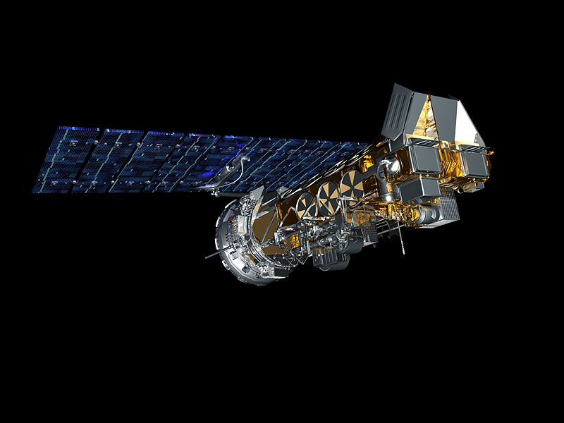

# SDR Mobile

Modern mobile handsets do have powerful processors that allow for signal processing in combination 
with SDR boards. The aim of this project is to research available software libraries that could 
potentially be used for this purpose and, if possible, implement a proof-of-concept system capable 
of receiving, decoding and displaying satellite data. NOAA satellites are a good target
because of their signal strength and well-known encoding standards. 
APT modulation scheme was chosen because of its low CPU demand and good signal quality.

[SDR Mobile](docs/sdr-mobile.png)

# Project structure

The project currently consists of 2 Android applications - benchmarks and sdr-mobile.

## Benchmarks application

The purpose of benchmarks application is to test how fast common DSP operations can be performed
on mobile devices and compare it to native implementation using C++. In its current form it tests:

* convolution
* FFT
* conversions between int, float and complex data types

Benchmark results can be downloaded in a form of rendered [IPython Notebook](https://gitlab.com/librespacefoundation/sdrmakerspace/sdr-mobile/blob/master/benchmarks/notebooks/benchmarks.html)

## SDR Mobile application

SDR Mobile application is the actual implementation of the NOAA decoder.

# Running the application

Both applications were developed with Android Studio and are managed by gradle. They can be ran 
either by using Android Studio or by downloading and installing the artifact from CI/CD pipeline.